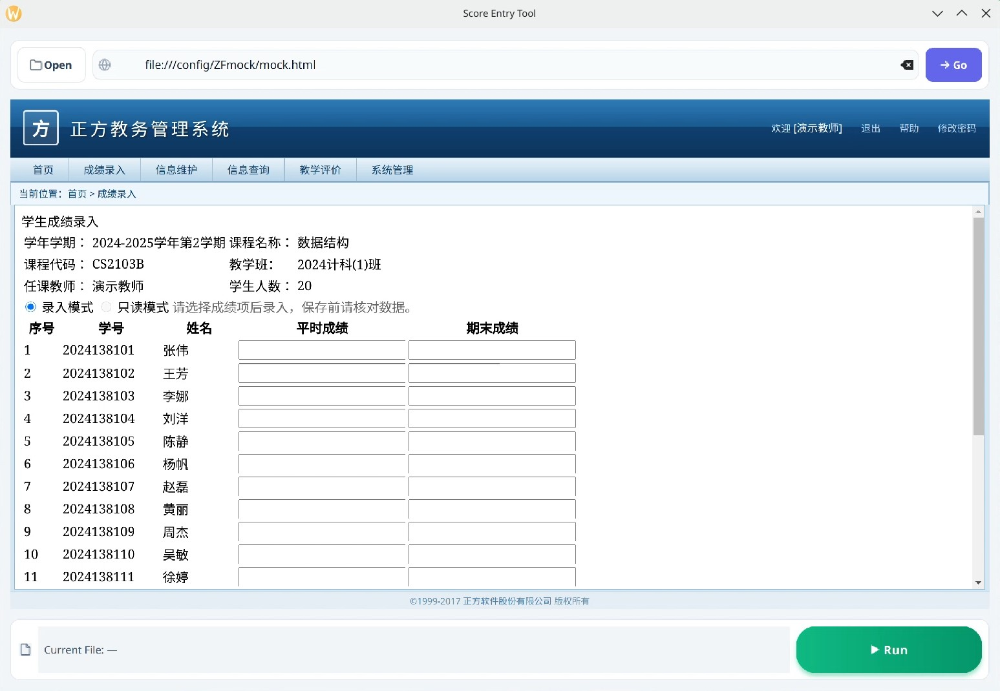
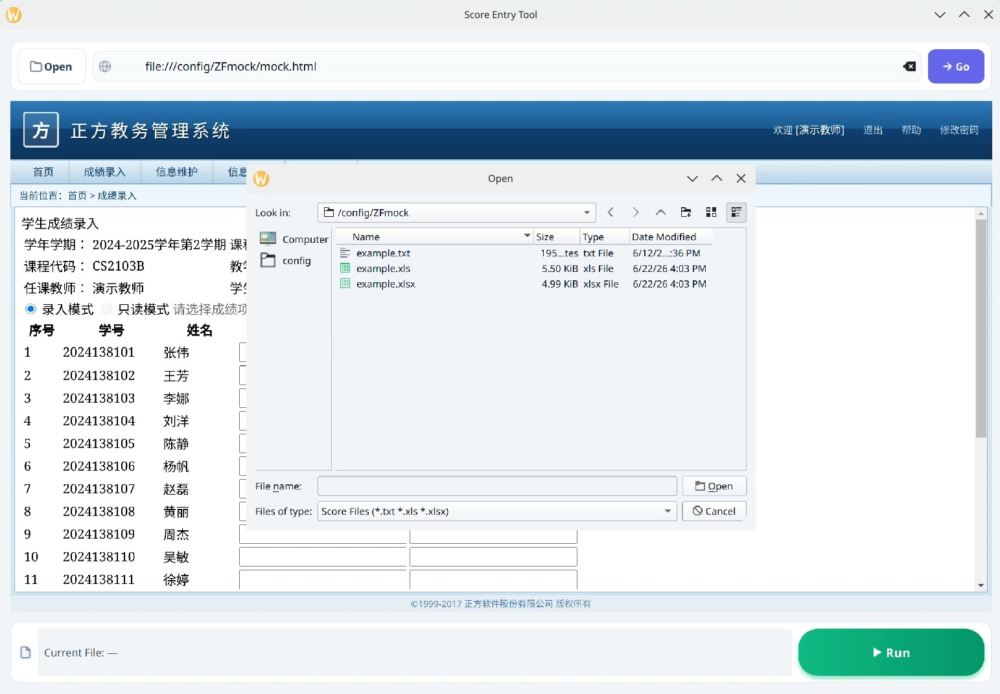
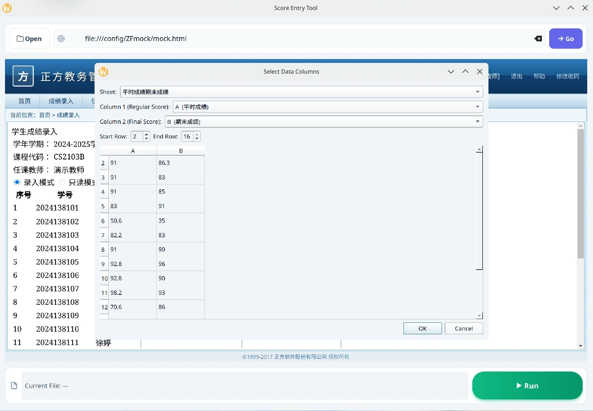
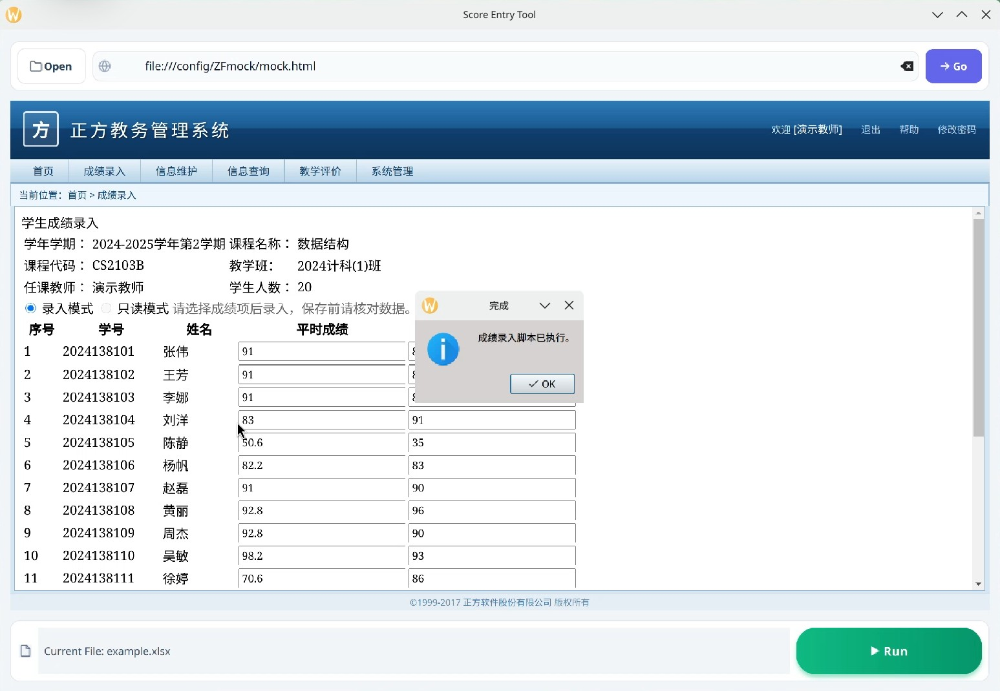

# ZFAutofill

A small desktop tool that automates score entry on the **正方教务系统**
(Zhengfang Educational Administration System) and other systems that use the
same DOM structure. It embeds the grade-entry page in a Qt WebEngine view,
reads scores from a local file (`.txt` / `.xls` / `.xlsx`) and injects them
into the web form via JavaScript.

一个用于 **正方教务系统** 成绩自动录入的桌面小工具。它在 Qt WebEngine 中
内嵌成绩录入页，读取本地成绩文件（`.txt` / `.xls` / `.xlsx`），然后通过
JavaScript 将成绩填入网页表单。

> **How generic is it?** The script targets the iframe name `zhuti`, which
> is the standard container in 正方教务系统. As long as your school's
> grade-entry form uses the same `iframe[name="zhuti"]` plus the
> `DataGrid1:_ctl{n}:ps` / `:qm` input names, this tool works. No other
> code changes needed.

<table>
  <tr>
    <td width="50%"></td>
    <td width="50%"></td>
  </tr>
  <tr>
    <td align="center"><em>程序主界面</em></td>
    <td align="center"><em>选取并打开 txt / xls / xlsx 文件</em></td>
  </tr>
  <tr>
    <td width="50%"></td>
    <td width="50%"></td>
  </tr>
  <tr>
    <td align="center"><em>Excel 列选择对话框</em></td>
    <td align="center"><em>自动填入成绩效果</em></td>
  </tr>
</table>

---

<video controls width="100%">
  <source src="media/demo.mp4" type="video/mp4">
</video>

*演示录屏使用本地演示网站 — 展示了从打开 mock 页面、选取 xlsx 文件，到最后自动填入成绩的完整流程。 · 背景音乐："Technology" by The_Mountain — Pixabay*

---

## 功能特性

- **内嵌浏览器** — 默认打开的是**金陵科技学院统一身份认证**页面。地址栏的内容会保存到 `config.json` 的 `base_url` 中。**请按自己学校的正方教务系统成绩录入页地址修改**。
- **地址栏 + 前往按钮** —— 修改地址后按 `Enter` 或点击 *前往*，新地址会
  立即写入 `config.json`，下次启动自动打开。相当于一个轻量的“历史记录”。
- **左上角「打开」按钮** —— 选择成绩文件：
  - `.txt`：每行两列，以任意空白分隔，例如 `91.0  86.3`。
  - `.xls` / `.xlsx`：弹出对话框，可以图形化地选择工作表、两列数据
    以及行号范围（如 `B3:B36`）。选择会被记住，下次一键复用。
- **圆润的「运行」按钮** —— 自动把成绩填入网页并触发保存。自带绿色光晕
  与播放图标，主操作一目了然。
- **自动填写成绩** —— 读取本地文件中的平时成绩和期末成绩，自动填入网页表单。
- **国际化** —— 界面文字跟随系统语言（English / 简体中文）。

## 从源码运行

1. 安装 Python 3.9 或更高版本。
2. 安装依赖：
   ```bash
   pip install -r requirements.txt
   ```
3. 运行程序：
   ```bash
   python main.py
   ```

## 使用步骤

1. **登录**方正教务系统（在内嵌浏览器中完成）。
2. **进入成绩录入页面**——应能看到平时成绩/期末成绩的表格。
3. **选择成绩文件**：点击左上角的 **打开** 按钮，选择成绩文件（支持 `.txt`、`.xls`、`.xlsx`）。
4. **启动**：点击右下角的 **运行** 按钮。
5. 程序会根据文件内容自动填写表格。

## 输入文件格式

**TXT** —— 每行一名学生，两列以任意空白分隔（平时成绩，期末成绩）：

```
91.0   86.3
91.0   83.0
83.0   91.0
50.6   35.0
```

**XLS / XLSX** —— 通过「打开」按钮加载后，弹窗中可以：

- 选择工作表
- 选择两列（例如 `B`、`C`）
- 设置行号范围（例如 起始 `3`、结束 `36` 表示 `B3:B36`）

对话框会记住上一次的设置，因此同一个文件再次运行只需点一次「打开」→「确定」。

## 构建可执行文件

使用项目自带的 `build.py` 可将项目打包为独立可执行文件：

```bash
python build.py          # 单文件模式（默认）
python build.py --dir    # 目录模式（编译更快）
```

输出在 `dist/` 目录下。需要 Python 3.9+ 和 PyInstaller（脚本会自动安装）。

## 配置说明

`config.json` 位于脚本同目录，会自动创建与更新。字段含义：

| key            | 含义                                       |
| -------------- | ------------------------------------------ |
| `base_url`     | 启动时打开的网址（也是你最后访问过的网址） |
| `last_sheet`   | 最近选择的工作表（仅 Excel）               |
| `last_col1`    | 第一列的 0-based 索引                      |
| `last_col2`    | 第二列的 0-based 索引                      |
| `last_start`   | 行号范围的起始行（1-based，含）            |
| `last_end`     | 行号范围的结束行（1-based，含）            |

缺失的字段会使用默认值，旧的配置文件不会出错。

## 本地演示网站 (ZFmock)

`ZFmock/` 目录包含无需连接真实教务系统即可试用的全部文件：

| 文件 | 用途 |
|---|---|
| `mock.html` | 模拟正方成绩录入界面的本地网页。在地址栏输入 `file:///path/to/ZFmock/mock.html` 即可打开（请替换为实际路径）。 |
| `example.txt` | 示例输入文件（纯文本，两列）。 |
| `example.xls` | 相同数据的旧版 Excel 格式。 |
| `example.xlsx` | 相同数据的新版 Excel 格式。 |

用 **打开** 按钮加载任一示例文件，再点击 **运行** 即可看到成绩自动填入演示页面。

## 适配其它教务系统

本工具默认针对 **正方教务系统**（其成绩录入页统一在
`iframe[name="zhuti"]` 中，输入框命名为
`DataGrid1:_ctl{n}:ps` / `:qm`）。如果你的学校使用了不同的 DOM 结构，
只需要修改 `run_scores.py` 中 `run_input_scores` 函数里的几行 JavaScript：

1. 修改 iframe 选择器，例如 `document.querySelector('iframe[name="其它"]')`。
2. 修改输入框命名模板，例如 `` `input[name="row_${i}"]` ``。
3. 修改保存按钮选择器，例如 `button.save-btn`。

其余的地址栏、文件加载、i18n、构建流水线全部保持不变。

## 常见问题

- *提示缺少依赖 `openpyxl` / `xlrd`* —— 执行
  `pip install openpyxl xlrd`（已在 `requirements.txt` 中）。
- *Excel 对话框下拉框是空的* —— 表格本身没有内容，请用 Excel/WPS 检查文件。
- *点击「运行」没反应* —— 请确认页面已经进入成绩录入界面，并且页面中存在
  `iframe[name="zhuti"]`。

## 协议

GNU GENERAL PUBLIC LICENSE v3.0

Copyright (C) 2025 ZFAutofill contributors

This program is free software: you can redistribute it and/or modify
it under the terms of the GNU General Public License as published by
the Free Software Foundation, either version 3 of the License, or
(at your option) any later version.

This program is distributed in the hope that it will be useful,
but WITHOUT ANY WARRANTY; without even the implied warranty of
MERCHANTABILITY or FITNESS FOR A PARTICULAR PURPOSE.  See the
GNU General Public License for more details.

You should have received a copy of the GNU General Public License
along with this program.  If not, see <https://www.gnu.org/licenses/>.

---